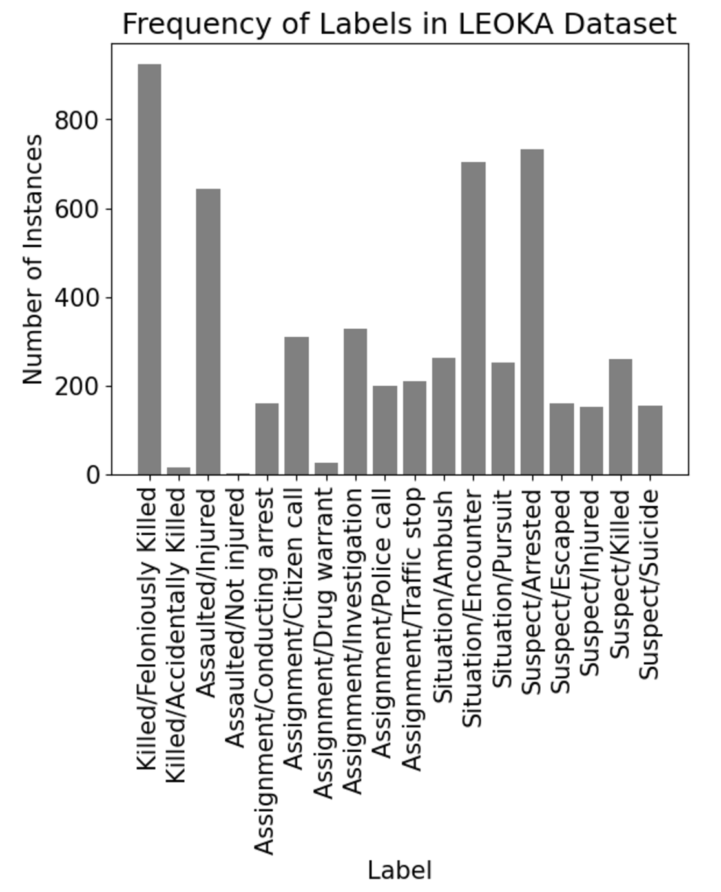

# Analysis of Annotations

This directory contains the statistics for training, dev, and test data and label space.

After processing annotations from Label Studio:

Discarded 13 invalid labels.
4 had no ground truth.

583 tasks for training.
349 for development.
234 for testing.

Graph of Label Space:

